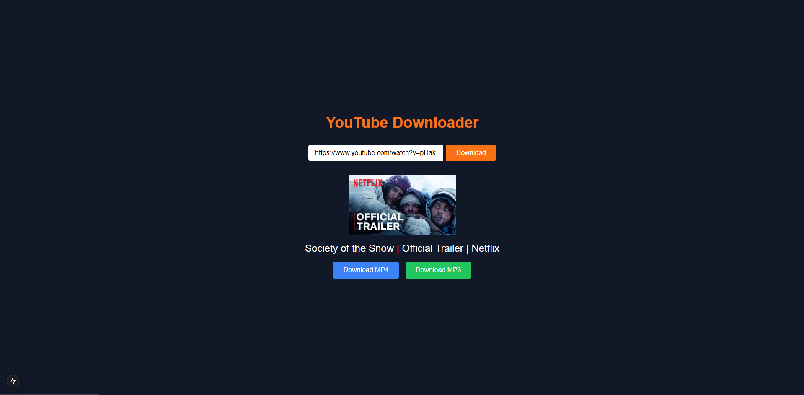

# YouTube Downloader with Next.js and Tailwind CSS

A web application for downloading YouTube videos and audio in MP4 or MP3 formats. The app is built with **Next.js**, styled using **Tailwind CSS**, and uses **yt-dlp** for video/audio processing.

## Features

- 🎥 **YouTube Metadata Fetching**: Displays video title, thumbnail, and duration before downloading.
- 📥 **Download Options**: Allows users to download YouTube videos as MP4 or audio as MP3.
- 🌙 **Dark Theme**: Elegant and responsive UI with a dark theme and orange accents.
- 📱 **Responsive Design**: Optimized for mobile and desktop devices.

## Screenshots



## Tech Stack

- **Frontend**: Next.js, React, Tailwind CSS
- **Backend**: Node.js (API Routes)
- **Video Processing**: `yt-dlp`

## Installation

**Clone this repository:**

```bash
git clone https://github.com/your-username/your-repo-name.git
cd your-repo-name
```
**Install dependencies:**

```bash
npm install
Start the development server:
```

```bash
npm run dev
Open the app in your browser:
```

```arduino
http://localhost:3000
```

## API Endpoints
- `/api/metadata:` Fetches metadata (e.g., title, thumbnail) for a given YouTube video URL.
- `/api/download:` Downloads the video or audio in the selected format.

## Contributing
Contributions are welcome! Please follow these steps:

### Fork the repository.
Create a new feature branch:

```bash
git checkout -b feature/your-feature-name
```

Commit your changes:

```bash
git commit -m "Add your feature description"
```
Push to the branch:

```bash
git push origin feature/your-feature-name
```

Open a pull request.

## License
This project is licensed under the MIT License.